# 🛠️ TerraFormancer

<p align="center">
  
  
</p>

<h3 align="center">
  The revolutionary tool that transforms natural language into deployable AWS infrastructure.
</h3>

---

TerraFormancer is a complete re-architecture of the original concept, built as a modern client-server application. It leverages the power of Large Language Models to understand your requests and generates Terraform HCL code, architecture diagrams, and deployment plans in real-time through a sleek, intuitive web interface. It now features a dedicated setup page, persistent chat sessions, and a more robust backend.

<br>

<p align="center">
  <a href="https://github.com/UnityNimit/TerraFormancer">
    
  </a>
</p>

## ✨ Core Features

-   **⚙️ One-Time Setup:** A dedicated setup page to securely enter your API credentials, which are stored locally.
-   **💾 Persistent Conversations:** Your chat history is automatically saved and can be resumed later, allowing you to manage multiple infrastructure projects.
-   **🤖 AI-Powered Generation:** Describe your infrastructure in plain English (or use your voice!), and let the AI architect the solution.
-   **🎨 Instant Visualization:** Automatically generates a cloud architecture diagram for any valid Terraform code, giving you immediate visual feedback.
-   **🚀 Full Deployment Lifecycle:** Go from an idea to a live deployment. The app handles `plan` and `apply` commands through a safe, user-approved workflow.
-   **💬 Interactive Chat UI:** A beautiful, animated, Telegram-style interface makes interacting with the AI a seamless experience.
-   **🎙️ Voice Commands:** Speak your vision into existence with integrated browser-based voice recognition.
-   **Robust Backend:** Built with FastAPI and LangGraph for a powerful, scalable, and stateful agentic workflow.

## 🛠️ The Tech Stack

| Category | Technology | Role |
| :--- | :--- | :--- |
| **Backend** | **Python** | Core Language |
| | FastAPI | Web Server & API |
| | LangGraph | AI Agent & State Machine |
| | Google Generative AI | LLM for Code Generation |
| | Diagrams | Architecture Visualization |
| **Frontend** | **HTML5** | Structure |
| | Tailwind CSS | Styling & UI |
| | Vanilla JavaScript | Interactivity & API Calls |
| **Tooling** | **Terraform** | Infrastructure as Code |
| | AWS | Target Cloud Provider |

## 🚀 Getting Started

<details>
<summary><strong>▶ Click to expand the step-by-step setup guide</strong></summary>

### Prerequisites

Make sure you have the following tools installed and configured on your system:

-   [Python 3.9+](https://www.python.org/downloads/)
-   [Terraform CLI](https://learn.hashicorp.com/tutorials/terraform/install-cli) (in your system's PATH)
-   [AWS CLI](https://aws.amazon.com/cli/) (configured with your credentials)

### ⚙️ Installation & Configuration

**1. Clone the Repository**

```sh
git clone https://github.com/UnityNimit/TerraFormancer.git
cd TerraFormancer
```

**2. Set Up the Backend Environment**

This involves creating a `requirements.txt` file, setting up a virtual environment, and installing dependencies.

i. **Navigate to the backend directory:**
```sh
cd backend
```

ii. **Create `requirements.txt`:** Inside the `/backend` folder, create a new file named `requirements.txt` and add the following content:

```txt
# backend/requirements.txt
fastapi[all]
uvicorn[standard]
python-dotenv
langgraph
langchain-core
langchain-google-genai
google-generativeai
speechrecognition
diagrams
python-hcl2
boto3
```

iii. **Install Dependencies:** Now, run these commands from the `/backend` directory:

```sh
# Create and activate a virtual environment
python -m venv venv

# On Windows:
.\venv\Scripts\activate

# On macOS/Linux:
source venv/bin/activate

# Install all required packages
pip install -r requirements.txt
```

**3. Configure Environment Variables via the App**

For this new version, you no longer need to manually create the `.env` file. You will configure the credentials through the application's web interface on the first run. The app will securely create and manage the `backend/.env` file for you.
```
# Sample env file backend/.env
GOOGLE_API_KEY="api-key"
AWS_ACCESS_KEY_ID="access-key"
AWS_SECRET_ACCESS_KEY="secret-access-key"
AWS_DEFAULT_REGION="dn-north-6"
```
</details>

## 🖥️ Usage

**1. Run the Backend Server**

From the `/backend` directory, with your virtual environment (`venv`) activated, run the Uvicorn server:

```sh
# Ensure you are in the TerraFormancer/backend directory
# Ensure your virtual environment is active: (venv) ...
python -m uvicorn app:app --reload --port 8000
```

The API is now running at `http://127.0.0.1:8000`.

**2. Open the Frontend in Your Browser**

Open a web browser and navigate to:

**`http://127.0.0.1:8000/`**

-   You will be greeted by the **Setup Page** (`start.html`). Here, you must enter your Google API Key and AWS credentials. These are saved locally in the `backend/.env` file.
-   Once saved, you can **Start a New Conversation** or resume a previous one. This will take you to the main chat interface (`index.html`).

> **Pro Tip:** For a better development experience, use a live server extension in your code editor (like "Live Server" for VS Code) and point it to the `frontend` directory if you are making changes to the UI.

## 📂 Project Structure

```
TerraFormancer/
├── backend/
│   ├── .env                # Secret keys and configuration (created by the app)
│   ├── agent_logic.py      # Core LangGraph and tool logic
│   ├── app.py              # FastAPI server
│   ├── diagram_generator.py # Diagram creation script
│   ├── requirements.txt    # Backend Python dependencies
│   ├── sessions/           # Stores persistent conversation data
│   ├── generated_files/    # Temporary storage for diagrams & code
│   └── venv/               # Python virtual environment
│
└── frontend/
    ├── index.html          # The main chat interface
    └── start.html          # The initial setup and session page
```

## 📈 System Architecture & Workflows

Here's a look at how the different parts of TerraFormancer interact.

### 🌐 High-Level System Architecture

This diagram shows the overall structure, connecting the user, the application stack, the AI engine, and external services.


### ⚙️ Initial Setup and Configuration Flow

This new flow illustrates how a user configures the application for the first time or resumes a session.


### 💬 User Chat & Artifact Generation Flow

This sequence diagram illustrates the step-by-step process from a user sending a message to receiving the generated code and diagram.


### 🚀 Two-Phase Deployment Workflow (Plan & Apply)

This flowchart details the safe deployment process, requiring the user to review a terraform plan before applying any changes.


### 💡 Tutorial Modal User Flow

A simple flow showing how the "How to Use" modal is triggered and dismissed by the user.


## 🤝 Contributing

Contributions are what make the open-source community such an amazing place to learn, inspire, and create. Any contributions you make are **greatly appreciated**.

1.  Fork the Project
2.  Create your Feature Branch (`git checkout -b feature/AmazingFeature`)
3.  Commit your Changes (`git commit -m 'Add some AmazingFeature'`)
4.  Push to the Branch (`git push origin feature/AmazingFeature`)
5.  Open a Pull Request


## 📂 Project Structure

```
TerraFormancer/
├── backend/
│   ├── .env                # Secret keys and configuration (created by the app)
│   ├── agent_logic.py      # Core LangGraph and tool logic
│   ├── app.py              # FastAPI server
│   ├── diagram_generator.py # Diagram creation script
│   ├── requirements.txt    # Backend Python dependencies
│   ├── sessions/           # Stores persistent conversation data
│   ├── generated_files/    # Temporary storage for diagrams & code
│   └── venv/               # Python virtual environment
│
└── frontend/
    ├── index.html          # The main chat interface
    └── start.html          # The initial setup and session page
```

## 📈 System Architecture & Workflows

Here's a look at how the different parts of TerraFormancer interact.

## 🌐 High-Level System Architecture
This diagram shows the overall structure, connecting the user, the application stack, the AI engine, and external services.


```mermaid
---
config:
  theme: redux-dark
  look: classic
---
flowchart TD
 subgraph User_Environment["User's Environment"]
    User(["👤 User"])
    Browser(["🌐 Web Browser"])
  end
 subgraph App_Stack["Application Stack"]
    Frontend(["🎨 Frontend UI"])
    Backend(["⚙️ Backend Server"])
  end
 subgraph AI_Engine["AI Engine"]
    LangGraph(["🧠 LangGraph"])
  end
 subgraph External["External Tools & Services"]
    GenAI(["Google AI API"])
    TerraformCLI(["Terraform CLI"])
    AWS(["AWS Cloud"])
  end
    User --> Browser
    Browser --> Frontend
    Frontend -- HTTP API --> Backend
    Backend -- Orchestrates --> LangGraph
    LangGraph -- API Call --> GenAI
    Backend -- Subprocess --> TerraformCLI
    TerraformCLI -- Provisions --> AWS
```

## 💬 User Chat & Artifact Generation Flow
This sequence diagram illustrates the step-by-step process from a user sending a message to receiving the generated code and diagram.


## 🚀 Two-Phase Deployment Workflow (Plan & Apply)
This flowchart details the safe deployment process, requiring the user to review a terraform plan before applying any changes.


## 💡 Tutorial Modal User Flow
A simple flow showing how the "How to Use" modal is triggered and dismissed by the user.


## 🤝 Contributing

Contributions are what make the open-source community such an amazing place to learn, inspire, and create. Any contributions you make are **greatly appreciated**.

1.  Fork the Project
2.  Create your Feature Branch (`git checkout -b feature/AmazingFeature`)
3.  Commit your Changes (`git commit -m 'Add some AmazingFeature'`)
4.  Push to the Branch (`git push origin feature/AmazingFeature`)
5.  Open a Pull Request
